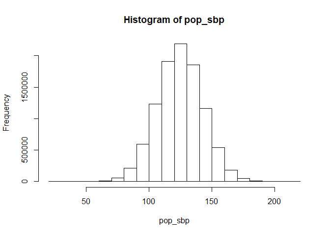
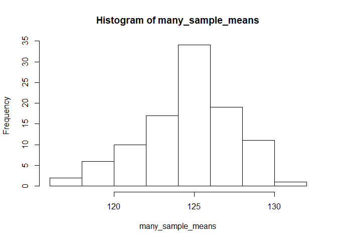
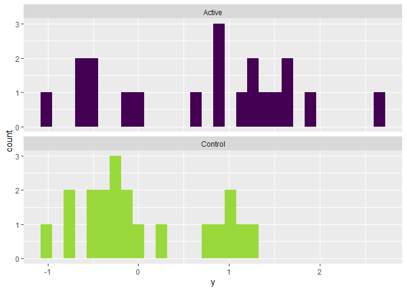
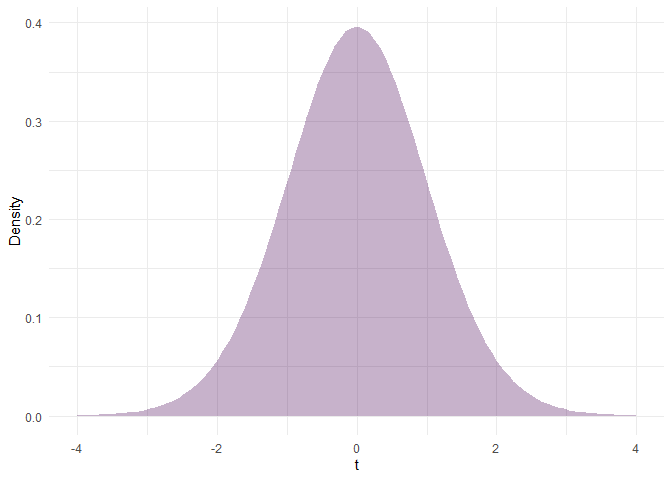
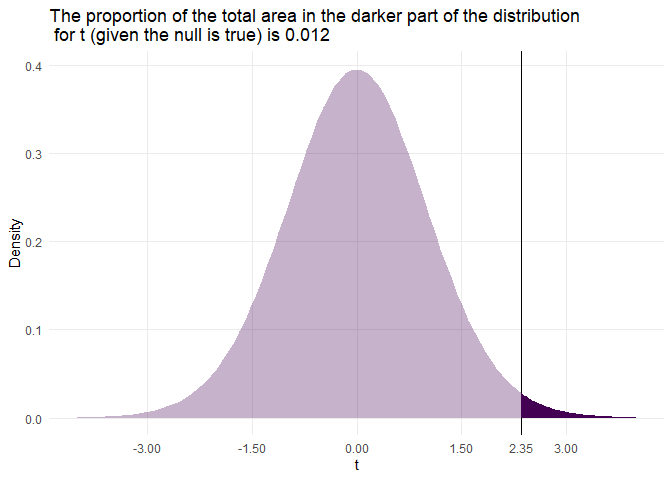
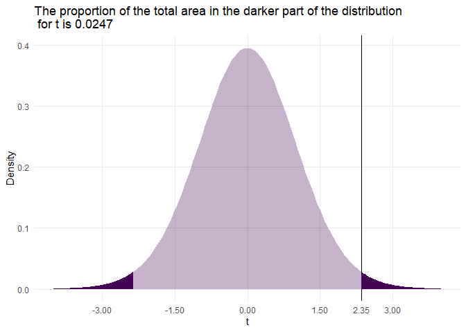

## Part 1. Estimands, estimators, and estimates

The primary aim of a clinical trial is to arrive at some number that tells us something useful about the "true" causal effect of the treatment we are testing. This number, which is calculated from the study data, is called an **estimate** of some corresponding "truth" called an **estimand**. The actual calculation or algorithm we used to provided this estimate of the estimand is called the **estimator**. 

Much of clinical science is about deciding what the important estimands are, asking, "What do we want to know?" On the other hand, much of statistics is about understanding and evaluating the properties of estimators, asking "What is the optimal way to learn it?" 


### A simple example. 

Let's say we want to estimate the mean systolic blood pressure in the population of Irish women, to help plan health services. One way to do this would be to take a random sample from this population, measure their blood pressures, and calculate the mean of the observed values. In this example, the estimand, estimator, and estimate are as follows:

- Estimand - The mean systolic blood pressure in the **population** of Irish women.
- Estimator - The mean systolic blood pressure in our **sample** of this population.
- Estimate - The actual value that arises from our estimator. 

Estimators have different properties that we can use to evaluate how useful they are. Importantly, our understanding of an estimators properties will usually rely on assumptions, for example, that the sample was truly a random draw from the population. 

To better understand all of this, let's simulate a large number of SBP measurements from a normal distribution with a known mean and standard deviation. This will be our population.  


```r
# First we will simulate our population

# Set the seed for the random number generator to preserve reproducability
  set.seed(1209) 

  pop_sbp <- rnorm(1e7, 124.5, 18.0) # Simulate a large population of values

  hist(pop_sbp)                      # Plot the distribution of those values
```

<!-- -->

```r
  summary(pop_sbp)                   # Summarize the distribution
```

```
##    Min. 1st Qu.  Median    Mean 3rd Qu.    Max. 
##   28.42  112.36  124.50  124.51  136.65  216.28
```

Next, let's draw a random sample from this population, and calculate the mean. The full procedure of taking a random sample of the population and calculating the mean of that sample is our estimator **for** the population mean. The actual number that results is our estimate **of** the population mean. 


```r
  sample_sbp <- sample(pop_sbp, 50, replace = FALSE) # Draw a sample of n = 50

  mean(sample_sbp) # Calculate the mean of the sample
```

```
## [1] 122.8668
```

We can immediately see that the sample mean is close to, but not exactly, the population mean (which we know was 124.5, from our simulation). Importantly, if we were to repeat the process using the **same** estimator, we would expect a **different** estimate. 


```r
# Draw another sample of n = 50 and calculate the mean
  mean(sample(pop_sbp, 50, replace = FALSE))
```

```
## [1] 124.215
```

So what happens if we repeat this process many times? We get a **sampling distribution** of sample means. This concept of a sampling distribution is critical to understanding the **frequentist** school of statistical inference that is most often used to interpret the results of clinical trials, as we will see below.


```r
# This is a custom function that drwas a sample from a population and then 
# calcuates the mean of those values. It takes 2 arguments: pop, which is a 
# dataframe object containing the population data we simulated; and n, which is 
# the size of the sample we want to draw.

  rep_means <- function(pop, n, ...){     
    round(mean(sample(pop, n, replace = FALSE)), 2)
  }                                       

# Use this new function 100 times and keep the results from each replicate
  many_sample_means <- replicate(100, rep_means(pop_sbp, 50)) 

  hist(many_sample_means)    # Plot the resulting distribution
```

<!-- -->

```r
  summary(many_sample_means) # Summarize it
```

```
##    Min. 1st Qu.  Median    Mean 3rd Qu.    Max. 
##   117.6   123.0   124.5   124.6   126.6   130.5
```


### Try it yourself

What do you think would happen to the distribution of the sample mean if we increased the number of observations that we sample from the population? Copy and modify the code above to see what would happen for sample of n = 100, 200, and 500.


## Part 2. Pesky p-values

Now we are going to simulate a clinical trial with a known effect of the intervention, and evaluate our estimate of that effect using the ubiquitous p-value. 


```r
  set.seed(0236)

# Simulate some study data into a dataframe. Tx effect = 0.5
  study_df <- data_frame(
    y = c(rnorm(20, 0, 1),                       # Control arm outcomes
          rnorm(20, 0, 1) + 0.5),                # Active arm outcomes
    arm = rep(c("Control", "Active"), each = 20) # Arm labels
  )

# Plot the distribtion of outcomes in each arm
  ggplot(study_df, aes(x = y, fill = arm)) +
    geom_histogram() +
    facet_wrap(~arm, ncol = 1) +
    scale_fill_viridis(guide = FALSE, discrete = TRUE, end = 0.85)
```

<!-- -->

```r
# Note: When we plotted the distribution before, we used so-called "base" R 
# plotting. Going forward, we will more often used a package called ggplot2 
# (which is included in the tidyverse family of packages).  
```

Now we will pretend that we don't know what the true effect of the treatment is (0.5). The difference in means between the two arms in this sample is 0.65. This of course isn't exactly 0.5, since the tx effect is added to an variable outcome measured in a sample. Thus some sampling variability should be expected.  

The actual test statistic we will use is called Student's t. It is a ratio of this difference in means to the standard error (which is what we call the standard deviation of a sampling distribution). You can think of it as a ratio of "signal to noise".  

Let's do it "by hand" so we can see how the p-value is calculated. 

The first step is to calculate the value for t from our sample data. This is our estimate. 

```r
# https://en.wikipedia.org/wiki/Welch's_t-test

# First, just to see how eveCalcuate T "by hand"
  m_act <- mean(study_df$y[study_df$arm == "Active"])
  m_con <- mean(study_df$y[study_df$arm == "Control"])
  v_act <-  var(study_df$y[study_df$arm == "Active"])
  v_con <-  var(study_df$y[study_df$arm == "Control"])
  n <- 20 # Sample size in each group
  se <- sqrt(v_act/n + v_con/n)
  df_s <- (v_act/n + v_con/n)^2 / # Need this for the sampling dist. below
          ((v_act^2 / (n^2 * (n - 1))) + 
           (v_con^2 / (n^2 * (n - 1))))
  
  t_sample <- round((m_act - m_con) / se, 2)
  
  t_sample
```

```
## [1] 2.35
```

Then we want to plot the sampling distribution of t under the null hypothesis that there is no different in the means (i.e. t = 0). The key parameter for this distribution is the degrees of freedom we calculated above (df_s). 


```r
# Get the expected sampling distibution under a null hypotheis of no difference
  
  g1 <- 
    ggplot(data_frame(x = c(-4 , 4)), aes(x = x)) + 
      stat_function(fun = dt, args = list(df = df_s), 
                    geom = "area", fill = viridis(1), alpha = 0.3) +
      xlim(c(-4 , 4)) +
      xlab("t") +
      ylab("Density") +
      theme_minimal()

  g1
```

<!-- -->

Then we plot the position of t for our sample, and calculate the area of the t distribution (under the null) for values of t as big or bigger than the value we actually observed. 


```r
  g2 <- 
    g1 +
    geom_vline(xintercept = t_sample) +
    stat_function(xlim = c(t_sample , 4), 
                  fun = dt, args = list(df = df_s), 
                  geom = "area", fill = viridis(1)) +
    scale_x_continuous(breaks = c(-3, -1.5, 0, 1.5, t_sample, 3)) +
    theme(panel.grid.minor = element_blank()) +
    ggtitle(paste0("The proportion of the total area in the darker part of the distribution\n for t (given the null is true) is ", signif(pt(t_sample, df_s, lower.tail = FALSE), 2)))

  g2
```

<!-- -->

This means that IF there was no treatment effect, AND the assumptions underlying our calculation of t and its distribution hold, AND we were able repeat our experiment many, many times, THEN we would only expect to see a value as large or larger than the one we calculated in *our* sample, 1.2% of the time. This is our p-value. 

So what can we do with this p-value? That's where things start to get tricky. At the risk of over-simplifying things, Fisher saw the p-value as a continuous measure of how surprised we should be if the data were truly generated under a mechanism of "no effect". So then a small p-value indicates there might be an effect worth further exploring or looking for in continued experiments. Then, if you were able able to repeat an experiment several times and consistently produce a small p-value, you might finally conclude that your intervention "works". 

Others would use the p-value as a hypothesis test. In the example above, it would be the null hypothesis of [t less than equal to zero] vs the alternative of [t greater than zero]. Then you would set some threshold for p (e.g. 5%) at which level you would "reject the null". We'll come back to this way of thinking below when we discuss power, and type 1 and 2 errors.    


In the example above, we only considered our estimate of t with respect to one tail of the sampling distribution of t under the null. This is what we refer to as a one-sided test. However, it usually makes more sense to make it relative to both tails, so that the null is [t not equal to zero] vs. [t less than OR greater than zero]. 


```r
  g3 <- 
    g2 +
    stat_function(xlim = c(t_sample , 4), 
                  fun = dt, args = list(df = df_s), 
                  geom = "area", fill = viridis(1)) +
    stat_function(xlim = c(-4, -t_sample), 
                  fun = dt, args = list(df = df_s), 
                  geom = "area", fill = viridis(1)) +
    ggtitle(paste0("The proportion of the total area in the darker part of the distribution\n for t is ", signif(2 * pt(t_sample, df_s, lower.tail = FALSE), 3)))

  g3
```

<!-- -->

Now this was a fair bit of work just to do a simple t-test. So now let's R do this for us (and confirm our result).


```r
  t.test(y ~ arm, data = study_df)
```

```
## 
## 	Welch Two Sample t-test
## 
## data:  y by arm
## t = 2.3472, df = 34.049, p-value = 0.02487
## alternative hypothesis: true difference in means is not equal to 0
## 95 percent confidence interval:
##  0.08755436 1.21698902
## sample estimates:
##  mean in group Active mean in group Control 
##            0.70603252            0.05376083
```


