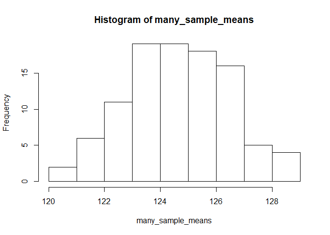

## Estimands, estimators, and estimates

In most clinical studies, we usually have some quantity that we want to estimate from data. That quantity is called an **estimand**, and in a clinical trial it is usually the causal effect of the treatment. Importantly, the data are always incomplete (i.e. we can't test the effect of the treatment in every possible eligible patient), so we must always view our **estimate** (i.e. the actual result we calcauted from the data) with suspicion. We know our estimate won't perfectly reflect the "true" value of the estimand, but how close is it? Or rather, how close could it be? The answer to this depends on the properties of the **estimator**, which is the actual calculation or algorithm used to arrive at the estimate. 

### A simple example. 

Let's say we want to estimate the mean systolic blood pressure in the population of Irish women. One way to do this would be to take a random sample from this population, measure their blood pressures, and calcuate the mean of the observed values. In this example, the estimand, estimator, and estimate are as follows:

Estimand - The mean systolic blood pressure in the population of Irish women. 
Estimator - The mean systolic blood pressure in our **sample** of this population.
Estimate - The actual value that arrises from our estimator. 

To demonstrate this, first we can simulate a large number of SBP measurements from a normal distribution with a known mean and standard deviation. 


```r
# First we will simulate our population

  pop_sbp <- rnorm(1e7, 124.5, 18.0)

  hist(pop_sbp)
```

<!-- -->

```r
  summary(pop_sbp)
```

```
##    Min. 1st Qu.  Median    Mean 3rd Qu.    Max. 
##   28.42  112.36  124.50  124.51  136.65  216.28
```

Next, we draw a random sample from this population, and calcuate the mean. This is our **estimator** of the population mean. 


```r
  sample_sbp <- sample(pop_sbp, 50, replace = FALSE)

  mean(sample_sbp)
```

```
## [1] 122.8668
```

We can immediately see that the sample mean is close to, but not exactly, the population mean. Importantly, if we were to repeat the process using the same **estimator**, we would expect a different **estimate**. 


```r
  mean(sample(pop_sbp, 50, replace = FALSE))
```

```
## [1] 124.215
```

So what happens if we repeat this process many times? We get a **sampling distribtion** of sample means. This concept of a sampling distribution is criticl to understanding frequentist statistical inferece that is used to interpret the results of most clinical trials. 


```r
  rep_means <- function(pop, n, ...){
    mean(sample(pop, n, replace = FALSE))
  }

  many_sample_means <- replicate(100, rep_means(pop_sbp, 100))

  hist(many_sample_means)
```

<!-- -->

```r
  summary(many_sample_means)
```

```
##    Min. 1st Qu.  Median    Mean 3rd Qu.    Max. 
##   120.3   123.4   124.6   124.6   126.0   128.9
```


