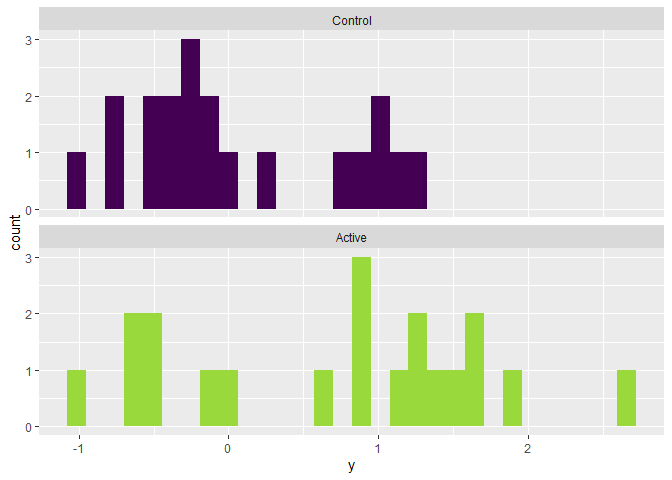

## Estimands, estimators, and estimates

In most clinical studies, we usually have some quantity that we want to estimate from data. That quantity is called an **estimand**, and in a clinical trial it is usually the causal effect of the treatment. Importantly, the data are always incomplete (i.e. we can't test the effect of the treatment in every possible eligible patient), so we must always view our **estimate** (i.e. the actual result we calculated from the data) with suspicion. We know our estimate won't perfectly reflect the "true" value of the estimand, but how close is it? Or rather, how close could it be? The answer to this depends on the properties of the **estimator**, which is the actual calculation or algorithm used to arrive at the estimate. 

### A simple example. 

Let's say we want to estimate the mean systolic blood pressure in the population of Irish women. One way to do this would be to take a random sample from this population, measure their blood pressures, and calculate the mean of the observed values. In this example, the estimand, estimator, and estimate are as follows:

Estimand - The mean systolic blood pressure in the population of Irish women. 
Estimator - The mean systolic blood pressure in our **sample** of this population.
Estimate - The actual value that arises from our estimator. 

To demonstrate this, first we can simulate a large number of SBP measurements from a normal distribution with a known mean and standard deviation. 


```r
# First we will simulate our population

# Set the seed for the random number generator to preserve reproducability
  set.seed(1209) 

  pop_sbp <- rnorm(1e7, 124.5, 18.0) # Simulate a large population of values

  hist(pop_sbp)                      # Plot the distribution of those values
```

<!-- -->

```r
  summary(pop_sbp)                   # Summarize the distribution
```

```
##    Min. 1st Qu.  Median    Mean 3rd Qu.    Max. 
##   28.42  112.36  124.50  124.51  136.65  216.28
```

Next, we draw a random sample from this population, and calculate the mean. This is our **estimator** of the population mean. 


```r
  sample_sbp <- sample(pop_sbp, 50, replace = FALSE) # Draw a sample of n = 50

  mean(sample_sbp) # Calculate the mean of the sample
```

```
## [1] 122.8668
```

We can immediately see that the sample mean is close to, but not exactly, the population mean. Importantly, if we were to repeat the process using the same **estimator**, we would expect a different **estimate**. 


```r
# Draw another sample of n = 50 and calculate the mean
  mean(sample(pop_sbp, 50, replace = FALSE))
```

```
## [1] 124.215
```

So what happens if we repeat this process many times? We get a **sampling distribution** of sample means. This concept of a sampling distribution is critical to understanding frequentist statistical inference that is used to interpret the results of most clinical trials, as we will see below.


```r
  rep_means <- function(pop, n, ...){     # Custom function that creates a 
    mean(sample(pop, n, replace = FALSE)) # sample of values and then calcuates
  }                                       # the mean of those values

# Use this new function 100 times and keep the results from each replicate
  many_sample_means <- replicate(100, rep_means(pop_sbp, 50)) 

  hist(many_sample_means)    # Plot the resulting distribution
```

<!-- -->

```r
  summary(many_sample_means) # Summarize it
```

```
##    Min. 1st Qu.  Median    Mean 3rd Qu.    Max. 
##   117.6   123.0   124.5   124.6   126.6   130.5
```


## Pesky p-values

First we will simulate some study data. 

```r
  set.seed(0236)

# Simulate some study data into a dataframe
  study_df <- data_frame(
    y = c(rnorm(20, 0, 1),                       # Control arm outcomes
          rnorm(20, 0, 1) + 0.5),                # Active arm outcomes
    arm = rep(c("Control", "Active"), each = 20) # Arm labels
  )
```

```
## Warning: `data_frame()` is deprecated, use `tibble()`.
## This warning is displayed once per session.
```

```r
# Plot the distribtion of outcomes in each arm
  ggplot(study_df, aes(x = y, fill = arm)) +
    geom_histogram() +
    facet_wrap(~arm, ncol = 1) +
    scale_fill_viridis(guide = FALSE, discrete = TRUE, end = 0.85)
```

```
## `stat_bin()` using `bins = 30`. Pick better value with `binwidth`.
```

<!-- -->

Here we will use Welsh's t-test for 2 samples with unequal variance. First we will do it "by hand" so we can see how the p-value is calculated. 

The first step is to calculate the value for t from our sample data. 

```r
# https://en.wikipedia.org/wiki/Welch's_t-test

# First, just to see how eveCalcuate T "by hand"
  m_act <- mean(study_df$y[study_df$arm == "Active"])
  m_con <- mean(study_df$y[study_df$arm == "Control"])
  v_act <-  var(study_df$y[study_df$arm == "Active"])
  v_con <-  var(study_df$y[study_df$arm == "Control"])
  n <- 20 # Sample size in each group
  se <- sqrt(v_act/n + v_con/n)
  df_s <- (v_act/n + v_con/n)^2 / 
          ((v_act^2 / (n^2 * (n - 1))) + 
           (v_con^2 / (n^2 * (n - 1))))
  
  t_sample <- (m_act - m_con) / se
  
  t_sample
```

```
## [1] 2.347201
```

Then we want to plot the sampling distribution of T under the null hypothesis that there is no different in the means (i.e. T = 0)


```r
# Get the expected sampling distibution under a null hypotheis of no difference
  
  g1 <- ggplot(data_frame(x = c(-4 , 4)), aes(x = x)) + 
          stat_function(fun = dt, args = list(df = df_s)) +
          xlim(c(-4 , 4)) +
          xlab("t") +
          ylab("Density")

  g1
```

<!-- -->

Then we plot the position of t in our sample for a 1-sided test. 


```r
  g1 +
    geom_vline(xintercept = t_sample) +
    stat_function(xlim = c(t_sample , 4), 
                  fun = dt, args = list(df = df_s), 
                  geom = "area", fill = "blue") +
    ggtitle(paste0("The area under the colored part of the distribution\n for t is ", signif(pt(t_sample, df_s, lower.tail = FALSE), 2)))
```

<!-- -->

Then we plot the position of t in our sample for a 2-sided test. 


```r
    g1 +
      geom_vline(xintercept = t_sample) +
      geom_vline(xintercept = -t_sample) +
      stat_function(xlim = c(t_sample , 4), 
                    fun = dt, args = list(df = df_s), 
                    geom = "area", fill = "blue") +
      stat_function(xlim = c(-4, -t_sample), 
                    fun = dt, args = list(df = df_s), 
                    geom = "area", fill = "blue") +
      ggtitle(paste0("The area under the colored part of the distribution\n for t is ", signif(2 * pt(t_sample, df_s, lower.tail = FALSE), 3)))
```

<!-- -->

# Confirm T-test with R


```r
  t.test(y ~ arm, data = study_df)
```

```
## 
## 	Welch Two Sample t-test
## 
## data:  y by arm
## t = 2.3472, df = 34.049, p-value = 0.02487
## alternative hypothesis: true difference in means is not equal to 0
## 95 percent confidence interval:
##  0.08755436 1.21698902
## sample estimates:
##  mean in group Active mean in group Control 
##            0.70603252            0.05376083
```


  

```

