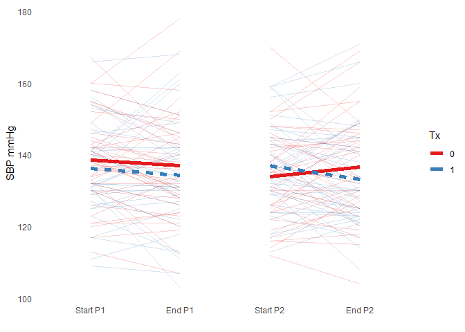
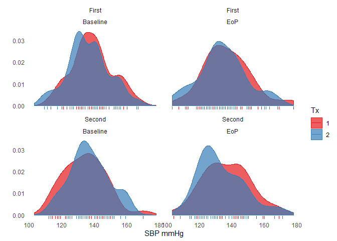

# Crossover trials

For this tutorial we will be working with a dataset from a standard 2 period, 2 intervention AB:BA crossover trial of a treatment aimed at lowering blood pressure in people who usually have mildly-evaluated values. In other words, each person in the trial gets exposured to each intervention (active vs placebo), but in one of two possible sequences (active first vs placebo first). 

As usuall, we will first load the neccessary packages and bring in the dataset. 


Have a look at the dataset. 


```r
# View(data)
```


```r
# view(dfSummary(data))
```

We can see there are 4 SBP values per patient (row). These are the start and end values for each of the two periods. To visualize and analyze these data correctly, we need to convert the dataset so that it's "long", i.e. one row for each time point


```r
# Reshape the data on 4 SBP values in order to plot the within period changes
# by tx group, get missing values. See functions.R

  data_long <- gather(data, time, value, starts_with("sbp")) %>%
    select(sequence, treatment_p1, treatment_p2, time, value, subj_id, sex, 
           everything()) %>%
    mutate(sequence = factor(sequence), treatment_p1 = factor(treatment_p1),
           treatment_p2 = factor(treatment_p2))

# view(dfSummary(data_long))
```

Now you can see there are five timepoints (screening, plus the start and end values for each of the two periods), each with 83 observations, which is the number of study participants. 

Now let's clean up the data a bit. 


```r
  data_long$time <- gsub("sbp__|sbp", "", data_long$time) # remove extraneous info

# Just reordering the levels so they mactch time. This will help when we plot
# the data. 
  times <- c("b_p1", "ep_p1", "b_p2", "ep_p2")

  data_long <- mutate(data_long, time = factor(time, levels = times)) 
# table(data_long$time)

# Create a new variable to reflect the period  
  data_long$period[grepl("_p1", data_long$time)] <- "First"
  data_long$period[grepl("_p2", data_long$time)] <- "Second"

# Create a new variable to reflect start (baseline) or end of period  
  bp <- grepl("b_p",  data_long$time) # Baseline times
  ep <- grepl("ep_p", data_long$time) # End times

  data_long$timing[bp] <- "Baseline"
  data_long$timing[ep] <- "EoP"
  
# with(data_long, table(period, timing))  

# These are the same info but we'll use them in the models below where I'll 
# explain why we want them split into 2 columns like this.   
  data_long$bl[bp] <- data_long$value[bp] # Baseline SBPs
  data_long$ep[ep] <- data_long$value[ep] # End SBPs

# Treatment indicator  
  p1 <- data_long$period == "First"  & !is.na(data_long$period)
  p2 <- data_long$period == "Second" & !is.na(data_long$period)
  data_long$tx[p1] <- data_long$treatment_p1[p1]
  data_long$tx[p2] <- data_long$treatment_p2[p2]

  data_long <- filter(data_long, !is.na(time)) %>%
    arrange(subj_id, period, timing) %>%
    select(subj_id, sequence, period, timing, tx, value, everything()) %>%
    mutate(period = factor(period),
           timing = factor(timing),
           tx  = factor(tx))

  data_long$time2 <- factor(data_long$time, labels = c("p1_b", "p1_ep",
                                         "p2_b", "p2_ep"))

# View(data_long)
  
# view(dfSummary(data_long))
```


```r
  ggplot(data_long, aes(x = time2, y = value, group = subj_id)) +
    geom_line(data = filter(data_long, as.numeric(time) < 3), alpha = 0.2,
              aes(color = treatment_p1)) +
    geom_smooth(data = filter(data_long, as.numeric(time) < 3), method = "lm",
                aes(color = treatment_p1, linetype = treatment_p1,
                group = treatment_p1),
                se = FALSE, size = 2) +
    geom_line(data = filter(data_long, as.numeric(time) > 2), alpha = 0.2,
              aes(color = treatment_p2)) +
    geom_smooth(data = filter(data_long, as.numeric(time) > 2), method = "lm",
                aes(color = treatment_p2, linetype = treatment_p2,
                    group = treatment_p2),
                se = FALSE, size = 2) +
    scale_linetype(guide = FALSE) +
    theme_minimal() +
    scale_color_brewer("Tx", palette = "Set1") +
    theme(panel.grid.major = element_blank(),
        panel.grid.minor = element_blank()) +
    scale_x_discrete(labels = c("Start P1", "End P1", "Start P2", "End P2")) +
    xlab("") +
    ylab("SBP mmHg")
```

<!-- -->


```r
# Distribution plot

  ggplot(data_long, aes(x = value, fill = tx, color = tx)) +
    geom_density(alpha = 0.7) +
    geom_rug() +
    scale_fill_brewer("Tx", palette = "Set1") +
    scale_color_brewer("Tx", palette = "Set1") +
    facet_wrap(~period + timing) +
    theme_minimal() +
    theme(panel.grid.major = element_blank(),
          panel.grid.minor = element_blank()) +
    ylab("") +
    xlab("SBP mmHg")
```

<!-- -->

## Modelling

Now we can model the effect of the treatment, though I suspect that you already have some idea of what it might be! Below, we'll use a set of models to make different adjustments for things like prognostic covariates (sex), period specific effects, and period-specific baseline (start) values. 


```r
# Models

# Re-configure the data so we can adjust for period-specific baselines if we
# want to. 

  me_sbp_df <- full_join(
    select(data_long, subj_id, sex, period, bl, tx) %>% filter(!is.na(bl)),
    select(data_long, subj_id, sex, period, ep, tx) %>% filter(!is.na(ep)),
    by = c("subj_id", "period", "tx", "sex")
  ) %>%
    mutate(bl = scale(bl, scale = FALSE))


# 4 models. Adjust for sex; + period; +tx*period interaction; +bl
  me_sbp     <- lmer(ep ~ tx + sex +               (1 | subj_id),
                     data = me_sbp_df)
  me_sbp_p   <- lmer(ep ~ tx + sex + period +      (1 | subj_id),
                     data = me_sbp_df)
  me_sbp_int <- lmer(ep ~ tx * period +  sex +     (1 | subj_id),
                     data = me_sbp_df)
  me_sbp_bl  <- lmer(ep ~ tx + sex + period + bl + (1 | subj_id),
                     data = me_sbp_df)

  labs <- c("Intercept", "Treatment", "Sex", "Period")

  tab_model(
    me_sbp, me_sbp_p, me_sbp_bl,
    p.val = "kr",
    file = "table_me_sbp.html",
    pred.labels = c(labs, "SBP Baseline"),
    dv.labels = c("Unadjusted", "+ Period effect", "+ Baselines")
    )
```

<table style="border-collapse:collapse; border:none;">
<tr>
<th style="border-top: double; text-align:center; font-style:normal; font-weight:bold; padding:0.2cm;  text-align:left; ">&nbsp;</th>
<th colspan="3" style="border-top: double; text-align:center; font-style:normal; font-weight:bold; padding:0.2cm; ">Unadjusted</th>
<th colspan="3" style="border-top: double; text-align:center; font-style:normal; font-weight:bold; padding:0.2cm; ">+ Period effect</th>
<th colspan="3" style="border-top: double; text-align:center; font-style:normal; font-weight:bold; padding:0.2cm; ">+ Baselines</th>
</tr>
<tr>
<td style=" text-align:center; border-bottom:1px solid; font-style:italic; font-weight:normal;  text-align:left; ">Predictors</td>
<td style=" text-align:center; border-bottom:1px solid; font-style:italic; font-weight:normal;  ">Estimates</td>
<td style=" text-align:center; border-bottom:1px solid; font-style:italic; font-weight:normal;  ">CI</td>
<td style=" text-align:center; border-bottom:1px solid; font-style:italic; font-weight:normal;  ">p</td>
<td style=" text-align:center; border-bottom:1px solid; font-style:italic; font-weight:normal;  ">Estimates</td>
<td style=" text-align:center; border-bottom:1px solid; font-style:italic; font-weight:normal;  ">CI</td>
<td style=" text-align:center; border-bottom:1px solid; font-style:italic; font-weight:normal;  col7">p</td>
<td style=" text-align:center; border-bottom:1px solid; font-style:italic; font-weight:normal;  col8">Estimates</td>
<td style=" text-align:center; border-bottom:1px solid; font-style:italic; font-weight:normal;  col9">CI</td>
<td style=" text-align:center; border-bottom:1px solid; font-style:italic; font-weight:normal;  0">p</td>
</tr>
<tr>
<td style=" padding:0.2cm; text-align:left; vertical-align:top; text-align:left; ">Intercept</td>
<td style=" padding:0.2cm; text-align:left; vertical-align:top; text-align:center;  ">137.79</td>
<td style=" padding:0.2cm; text-align:left; vertical-align:top; text-align:center;  ">133.78&nbsp;&ndash;&nbsp;141.80</td>
<td style=" padding:0.2cm; text-align:left; vertical-align:top; text-align:center;  "><strong>&lt;0.001</td>
<td style=" padding:0.2cm; text-align:left; vertical-align:top; text-align:center;  ">138.21</td>
<td style=" padding:0.2cm; text-align:left; vertical-align:top; text-align:center;  ">134.03&nbsp;&ndash;&nbsp;142.40</td>
<td style=" padding:0.2cm; text-align:left; vertical-align:top; text-align:center;  col7"><strong>&lt;0.001</td>
<td style=" padding:0.2cm; text-align:left; vertical-align:top; text-align:center;  col8">136.18</td>
<td style=" padding:0.2cm; text-align:left; vertical-align:top; text-align:center;  col9">132.98&nbsp;&ndash;&nbsp;139.39</td>
<td style=" padding:0.2cm; text-align:left; vertical-align:top; text-align:center;  0"><strong>&lt;0.001</td>
</tr>
<tr>
<td style=" padding:0.2cm; text-align:left; vertical-align:top; text-align:left; ">Treatment</td>
<td style=" padding:0.2cm; text-align:left; vertical-align:top; text-align:center;  ">0.24</td>
<td style=" padding:0.2cm; text-align:left; vertical-align:top; text-align:center;  ">-2.12&nbsp;&ndash;&nbsp;2.61</td>
<td style=" padding:0.2cm; text-align:left; vertical-align:top; text-align:center;  ">0.840</td>
<td style=" padding:0.2cm; text-align:left; vertical-align:top; text-align:center;  ">0.25</td>
<td style=" padding:0.2cm; text-align:left; vertical-align:top; text-align:center;  ">-2.12&nbsp;&ndash;&nbsp;2.63</td>
<td style=" padding:0.2cm; text-align:left; vertical-align:top; text-align:center;  col7">0.834</td>
<td style=" padding:0.2cm; text-align:left; vertical-align:top; text-align:center;  col8">-0.08</td>
<td style=" padding:0.2cm; text-align:left; vertical-align:top; text-align:center;  col9">-2.92&nbsp;&ndash;&nbsp;2.77</td>
<td style=" padding:0.2cm; text-align:left; vertical-align:top; text-align:center;  0">0.957</td>
</tr>
<tr>
<td style=" padding:0.2cm; text-align:left; vertical-align:top; text-align:left; ">Sex</td>
<td style=" padding:0.2cm; text-align:left; vertical-align:top; text-align:center;  ">-2.94</td>
<td style=" padding:0.2cm; text-align:left; vertical-align:top; text-align:center;  ">-8.67&nbsp;&ndash;&nbsp;2.79</td>
<td style=" padding:0.2cm; text-align:left; vertical-align:top; text-align:center;  ">0.317</td>
<td style=" padding:0.2cm; text-align:left; vertical-align:top; text-align:center;  ">-2.96</td>
<td style=" padding:0.2cm; text-align:left; vertical-align:top; text-align:center;  ">-8.69&nbsp;&ndash;&nbsp;2.77</td>
<td style=" padding:0.2cm; text-align:left; vertical-align:top; text-align:center;  col7">0.315</td>
<td style=" padding:0.2cm; text-align:left; vertical-align:top; text-align:center;  col8">0.80</td>
<td style=" padding:0.2cm; text-align:left; vertical-align:top; text-align:center;  col9">-2.94&nbsp;&ndash;&nbsp;4.53</td>
<td style=" padding:0.2cm; text-align:left; vertical-align:top; text-align:center;  0">0.677</td>
</tr>
<tr>
<td style=" padding:0.2cm; text-align:left; vertical-align:top; text-align:left; ">Period</td>
<td style=" padding:0.2cm; text-align:left; vertical-align:top; text-align:center;  "></td>
<td style=" padding:0.2cm; text-align:left; vertical-align:top; text-align:center;  "></td>
<td style=" padding:0.2cm; text-align:left; vertical-align:top; text-align:center;  "></td>
<td style=" padding:0.2cm; text-align:left; vertical-align:top; text-align:center;  ">-0.84</td>
<td style=" padding:0.2cm; text-align:left; vertical-align:top; text-align:center;  ">-3.21&nbsp;&ndash;&nbsp;1.54</td>
<td style=" padding:0.2cm; text-align:left; vertical-align:top; text-align:center;  col7">0.491</td>
<td style=" padding:0.2cm; text-align:left; vertical-align:top; text-align:center;  col8">0.51</td>
<td style=" padding:0.2cm; text-align:left; vertical-align:top; text-align:center;  col9">-2.35&nbsp;&ndash;&nbsp;3.37</td>
<td style=" padding:0.2cm; text-align:left; vertical-align:top; text-align:center;  0">0.726</td>
</tr>
<tr>
<td style=" padding:0.2cm; text-align:left; vertical-align:top; text-align:left; ">SBP Baseline</td>
<td style=" padding:0.2cm; text-align:left; vertical-align:top; text-align:center;  "></td>
<td style=" padding:0.2cm; text-align:left; vertical-align:top; text-align:center;  "></td>
<td style=" padding:0.2cm; text-align:left; vertical-align:top; text-align:center;  "></td>
<td style=" padding:0.2cm; text-align:left; vertical-align:top; text-align:center;  "></td>
<td style=" padding:0.2cm; text-align:left; vertical-align:top; text-align:center;  "></td>
<td style=" padding:0.2cm; text-align:left; vertical-align:top; text-align:center;  col7"></td>
<td style=" padding:0.2cm; text-align:left; vertical-align:top; text-align:center;  col8">0.71</td>
<td style=" padding:0.2cm; text-align:left; vertical-align:top; text-align:center;  col9">0.57&nbsp;&ndash;&nbsp;0.85</td>
<td style=" padding:0.2cm; text-align:left; vertical-align:top; text-align:center;  0"><strong>&lt;0.001</td>
</tr>
<tr>
<td colspan="10" style="font-weight:bold; text-align:left; padding-top:.8em;">Random Effects</td>
</tr>

<tr>
<td style=" padding:0.2cm; text-align:left; vertical-align:top; text-align:left; padding-top:0.1cm; padding-bottom:0.1cm;">&sigma;<sup>2</sup></td>
<td style=" padding:0.2cm; text-align:left; vertical-align:top; padding-top:0.1cm; padding-bottom:0.1cm; text-align:left;" colspan="3">59.31</td>
<td style=" padding:0.2cm; text-align:left; vertical-align:top; padding-top:0.1cm; padding-bottom:0.1cm; text-align:left;" colspan="3">59.68</td>
<td style=" padding:0.2cm; text-align:left; vertical-align:top; padding-top:0.1cm; padding-bottom:0.1cm; text-align:left;" colspan="3">85.50</td>

<tr>
<td style=" padding:0.2cm; text-align:left; vertical-align:top; text-align:left; padding-top:0.1cm; padding-bottom:0.1cm;">&tau;<sub>00</sub></td>
<td style=" padding:0.2cm; text-align:left; vertical-align:top; padding-top:0.1cm; padding-bottom:0.1cm; text-align:left;" colspan="3">144.89 <sub>subj_id</sub></td>
<td style=" padding:0.2cm; text-align:left; vertical-align:top; padding-top:0.1cm; padding-bottom:0.1cm; text-align:left;" colspan="3">144.76 <sub>subj_id</sub></td>
<td style=" padding:0.2cm; text-align:left; vertical-align:top; padding-top:0.1cm; padding-bottom:0.1cm; text-align:left;" colspan="3">27.63 <sub>subj_id</sub></td>

<tr>
<td style=" padding:0.2cm; text-align:left; vertical-align:top; text-align:left; padding-top:0.1cm; padding-bottom:0.1cm;">ICC</td>
<td style=" padding:0.2cm; text-align:left; vertical-align:top; padding-top:0.1cm; padding-bottom:0.1cm; text-align:left;" colspan="3">0.71</td>
<td style=" padding:0.2cm; text-align:left; vertical-align:top; padding-top:0.1cm; padding-bottom:0.1cm; text-align:left;" colspan="3">0.71</td>
<td style=" padding:0.2cm; text-align:left; vertical-align:top; padding-top:0.1cm; padding-bottom:0.1cm; text-align:left;" colspan="3">0.24</td>

<tr>
<td style=" padding:0.2cm; text-align:left; vertical-align:top; text-align:left; padding-top:0.1cm; padding-bottom:0.1cm;">N</td>
<td style=" padding:0.2cm; text-align:left; vertical-align:top; padding-top:0.1cm; padding-bottom:0.1cm; text-align:left;" colspan="3">83 <sub>subj_id</sub></td>
<td style=" padding:0.2cm; text-align:left; vertical-align:top; padding-top:0.1cm; padding-bottom:0.1cm; text-align:left;" colspan="3">83 <sub>subj_id</sub></td>
<td style=" padding:0.2cm; text-align:left; vertical-align:top; padding-top:0.1cm; padding-bottom:0.1cm; text-align:left;" colspan="3">83 <sub>subj_id</sub></td>
<tr>
<td style=" padding:0.2cm; text-align:left; vertical-align:top; text-align:left; padding-top:0.1cm; padding-bottom:0.1cm; border-top:1px solid;">Observations</td>
<td style=" padding:0.2cm; text-align:left; vertical-align:top; padding-top:0.1cm; padding-bottom:0.1cm; text-align:left; border-top:1px solid;" colspan="3">164</td>
<td style=" padding:0.2cm; text-align:left; vertical-align:top; padding-top:0.1cm; padding-bottom:0.1cm; text-align:left; border-top:1px solid;" colspan="3">164</td>
<td style=" padding:0.2cm; text-align:left; vertical-align:top; padding-top:0.1cm; padding-bottom:0.1cm; text-align:left; border-top:1px solid;" colspan="3">163</td>
</tr>
<tr>
<td style=" padding:0.2cm; text-align:left; vertical-align:top; text-align:left; padding-top:0.1cm; padding-bottom:0.1cm;">Marginal R<sup>2</sup> / Conditional R<sup>2</sup></td>
<td style=" padding:0.2cm; text-align:left; vertical-align:top; padding-top:0.1cm; padding-bottom:0.1cm; text-align:left;" colspan="3">0.010 / 0.713</td>
<td style=" padding:0.2cm; text-align:left; vertical-align:top; padding-top:0.1cm; padding-bottom:0.1cm; text-align:left;" colspan="3">0.011 / 0.711</td>
<td style=" padding:0.2cm; text-align:left; vertical-align:top; padding-top:0.1cm; padding-bottom:0.1cm; text-align:left;" colspan="3">0.404 / 0.549</td>
</tr>

</table>

So that confirms what we probably should have expected from the plotting, which is that there was no appreciable effect on the outcome. But just for fun, now we will add an effect. We are going to make is pretty big, equal to -10 mmHg (almost a full SD of the observed SBP values), and add it to the active tx values. 


```r
  effect <- -3

  data_long$value_2 <- data_long$value

  tar <- data_long$tx == 2 & data_long$timing == "EoP"

  data_long$value_2[tar] <- data_long$value_2[tar] + effect
  
  data_long$ep_2 <- data_long$ep
  
  data_long$ep_2[tar] <- data_long$ep_2[tar] + effect
```

Now just repeat everything we did before, replacing value_2 for value. 
 

```r
  ggplot(data_long, aes(x = time2, y = value_2, group = subj_id)) +
    geom_line(data = filter(data_long, as.numeric(time) < 3), alpha = 0.2,
              aes(color = treatment_p1)) +
    geom_smooth(data = filter(data_long, as.numeric(time) < 3), method = "lm",
                aes(color = treatment_p1, linetype = treatment_p1,
                group = treatment_p1),
                se = FALSE, size = 2) +
    geom_line(data = filter(data_long, as.numeric(time) > 2), alpha = 0.2,
              aes(color = treatment_p2)) +
    geom_smooth(data = filter(data_long, as.numeric(time) > 2), method = "lm",
                aes(color = treatment_p2, linetype = treatment_p2,
                    group = treatment_p2),
                se = FALSE, size = 2) +
    scale_linetype(guide = FALSE) +
    theme_minimal() +
    scale_color_brewer("Tx", palette = "Set1") +
    theme(panel.grid.major = element_blank(),
        panel.grid.minor = element_blank()) +
    scale_x_discrete(labels = c("Start P1", "End P1", "Start P2", "End P2")) +
    xlab("") +
    ylab("SBP mmHg")
```

<!-- -->


```r
  ggplot(data_long, aes(x = value_2, fill = tx, color = tx)) +
    geom_density(alpha = 0.7) +
    geom_rug() +
    scale_fill_brewer("Tx", palette = "Set1") +
    scale_color_brewer("Tx", palette = "Set1") +
    facet_wrap(~period + timing) +
    theme_minimal() +
    theme(panel.grid.major = element_blank(),
          panel.grid.minor = element_blank()) +
    ylab("") +
    xlab("SBP mmHg")
```

<!-- -->


```r
# Models

# Re-configure the data so we can adjust for period-specific baselines if we
# want to. 

  me_sbp_df <- full_join(
    select(data_long, subj_id, sex, period, bl, tx) %>%   filter(!is.na(bl)),
    select(data_long, subj_id, sex, period, ep_2, tx) %>% filter(!is.na(ep_2)),
    by = c("subj_id", "period", "tx", "sex")
  ) %>%
    mutate(bl = scale(bl, scale = FALSE))


# 4 models. Adjust for sex; + period; +tx*period interaction; +bl
  me_sbp     <- lmer(ep_2 ~ tx + sex +               (1 | subj_id),
                     data = me_sbp_df)
  me_sbp_p   <- lmer(ep_2 ~ tx + sex + period +      (1 | subj_id),
                     data = me_sbp_df)
  me_sbp_int <- lmer(ep_2 ~ tx * period +  sex +     (1 | subj_id),
                     data = me_sbp_df)
  me_sbp_bl  <- lmer(ep_2 ~ tx + sex + period + bl + (1 | subj_id),
                     data = me_sbp_df)

  labs <- c("Intercept", "Treatment", "Sex", "Period")

  tab_model(
    me_sbp, me_sbp_p, me_sbp_bl,
    p.val = "kr",
    file = "table_me_sbp.html",
    pred.labels = c(labs, "SBP Baseline"),
    dv.labels = c("Unadjusted", "+ Period effect", "+ Baselines")
    )
```

<table style="border-collapse:collapse; border:none;">
<tr>
<th style="border-top: double; text-align:center; font-style:normal; font-weight:bold; padding:0.2cm;  text-align:left; ">&nbsp;</th>
<th colspan="3" style="border-top: double; text-align:center; font-style:normal; font-weight:bold; padding:0.2cm; ">Unadjusted</th>
<th colspan="3" style="border-top: double; text-align:center; font-style:normal; font-weight:bold; padding:0.2cm; ">+ Period effect</th>
<th colspan="3" style="border-top: double; text-align:center; font-style:normal; font-weight:bold; padding:0.2cm; ">+ Baselines</th>
</tr>
<tr>
<td style=" text-align:center; border-bottom:1px solid; font-style:italic; font-weight:normal;  text-align:left; ">Predictors</td>
<td style=" text-align:center; border-bottom:1px solid; font-style:italic; font-weight:normal;  ">Estimates</td>
<td style=" text-align:center; border-bottom:1px solid; font-style:italic; font-weight:normal;  ">CI</td>
<td style=" text-align:center; border-bottom:1px solid; font-style:italic; font-weight:normal;  ">p</td>
<td style=" text-align:center; border-bottom:1px solid; font-style:italic; font-weight:normal;  ">Estimates</td>
<td style=" text-align:center; border-bottom:1px solid; font-style:italic; font-weight:normal;  ">CI</td>
<td style=" text-align:center; border-bottom:1px solid; font-style:italic; font-weight:normal;  col7">p</td>
<td style=" text-align:center; border-bottom:1px solid; font-style:italic; font-weight:normal;  col8">Estimates</td>
<td style=" text-align:center; border-bottom:1px solid; font-style:italic; font-weight:normal;  col9">CI</td>
<td style=" text-align:center; border-bottom:1px solid; font-style:italic; font-weight:normal;  0">p</td>
</tr>
<tr>
<td style=" padding:0.2cm; text-align:left; vertical-align:top; text-align:left; ">Intercept</td>
<td style=" padding:0.2cm; text-align:left; vertical-align:top; text-align:center;  ">137.79</td>
<td style=" padding:0.2cm; text-align:left; vertical-align:top; text-align:center;  ">133.78&nbsp;&ndash;&nbsp;141.80</td>
<td style=" padding:0.2cm; text-align:left; vertical-align:top; text-align:center;  "><strong>&lt;0.001</td>
<td style=" padding:0.2cm; text-align:left; vertical-align:top; text-align:center;  ">138.21</td>
<td style=" padding:0.2cm; text-align:left; vertical-align:top; text-align:center;  ">134.03&nbsp;&ndash;&nbsp;142.40</td>
<td style=" padding:0.2cm; text-align:left; vertical-align:top; text-align:center;  col7"><strong>&lt;0.001</td>
<td style=" padding:0.2cm; text-align:left; vertical-align:top; text-align:center;  col8">136.18</td>
<td style=" padding:0.2cm; text-align:left; vertical-align:top; text-align:center;  col9">132.98&nbsp;&ndash;&nbsp;139.39</td>
<td style=" padding:0.2cm; text-align:left; vertical-align:top; text-align:center;  0"><strong>&lt;0.001</td>
</tr>
<tr>
<td style=" padding:0.2cm; text-align:left; vertical-align:top; text-align:left; ">Treatment</td>
<td style=" padding:0.2cm; text-align:left; vertical-align:top; text-align:center;  ">-2.76</td>
<td style=" padding:0.2cm; text-align:left; vertical-align:top; text-align:center;  ">-5.12&nbsp;&ndash;&nbsp;-0.39</td>
<td style=" padding:0.2cm; text-align:left; vertical-align:top; text-align:center;  "><strong>0.025</strong></td>
<td style=" padding:0.2cm; text-align:left; vertical-align:top; text-align:center;  ">-2.75</td>
<td style=" padding:0.2cm; text-align:left; vertical-align:top; text-align:center;  ">-5.12&nbsp;&ndash;&nbsp;-0.37</td>
<td style=" padding:0.2cm; text-align:left; vertical-align:top; text-align:center;  col7"><strong>0.026</strong></td>
<td style=" padding:0.2cm; text-align:left; vertical-align:top; text-align:center;  col8">-3.08</td>
<td style=" padding:0.2cm; text-align:left; vertical-align:top; text-align:center;  col9">-5.92&nbsp;&ndash;&nbsp;-0.23</td>
<td style=" padding:0.2cm; text-align:left; vertical-align:top; text-align:center;  0"><strong>0.037</strong></td>
</tr>
<tr>
<td style=" padding:0.2cm; text-align:left; vertical-align:top; text-align:left; ">Sex</td>
<td style=" padding:0.2cm; text-align:left; vertical-align:top; text-align:center;  ">-2.94</td>
<td style=" padding:0.2cm; text-align:left; vertical-align:top; text-align:center;  ">-8.67&nbsp;&ndash;&nbsp;2.79</td>
<td style=" padding:0.2cm; text-align:left; vertical-align:top; text-align:center;  ">0.317</td>
<td style=" padding:0.2cm; text-align:left; vertical-align:top; text-align:center;  ">-2.96</td>
<td style=" padding:0.2cm; text-align:left; vertical-align:top; text-align:center;  ">-8.69&nbsp;&ndash;&nbsp;2.77</td>
<td style=" padding:0.2cm; text-align:left; vertical-align:top; text-align:center;  col7">0.315</td>
<td style=" padding:0.2cm; text-align:left; vertical-align:top; text-align:center;  col8">0.80</td>
<td style=" padding:0.2cm; text-align:left; vertical-align:top; text-align:center;  col9">-2.94&nbsp;&ndash;&nbsp;4.53</td>
<td style=" padding:0.2cm; text-align:left; vertical-align:top; text-align:center;  0">0.677</td>
</tr>
<tr>
<td style=" padding:0.2cm; text-align:left; vertical-align:top; text-align:left; ">Period</td>
<td style=" padding:0.2cm; text-align:left; vertical-align:top; text-align:center;  "></td>
<td style=" padding:0.2cm; text-align:left; vertical-align:top; text-align:center;  "></td>
<td style=" padding:0.2cm; text-align:left; vertical-align:top; text-align:center;  "></td>
<td style=" padding:0.2cm; text-align:left; vertical-align:top; text-align:center;  ">-0.84</td>
<td style=" padding:0.2cm; text-align:left; vertical-align:top; text-align:center;  ">-3.21&nbsp;&ndash;&nbsp;1.54</td>
<td style=" padding:0.2cm; text-align:left; vertical-align:top; text-align:center;  col7">0.491</td>
<td style=" padding:0.2cm; text-align:left; vertical-align:top; text-align:center;  col8">0.51</td>
<td style=" padding:0.2cm; text-align:left; vertical-align:top; text-align:center;  col9">-2.35&nbsp;&ndash;&nbsp;3.37</td>
<td style=" padding:0.2cm; text-align:left; vertical-align:top; text-align:center;  0">0.726</td>
</tr>
<tr>
<td style=" padding:0.2cm; text-align:left; vertical-align:top; text-align:left; ">SBP Baseline</td>
<td style=" padding:0.2cm; text-align:left; vertical-align:top; text-align:center;  "></td>
<td style=" padding:0.2cm; text-align:left; vertical-align:top; text-align:center;  "></td>
<td style=" padding:0.2cm; text-align:left; vertical-align:top; text-align:center;  "></td>
<td style=" padding:0.2cm; text-align:left; vertical-align:top; text-align:center;  "></td>
<td style=" padding:0.2cm; text-align:left; vertical-align:top; text-align:center;  "></td>
<td style=" padding:0.2cm; text-align:left; vertical-align:top; text-align:center;  col7"></td>
<td style=" padding:0.2cm; text-align:left; vertical-align:top; text-align:center;  col8">0.71</td>
<td style=" padding:0.2cm; text-align:left; vertical-align:top; text-align:center;  col9">0.57&nbsp;&ndash;&nbsp;0.85</td>
<td style=" padding:0.2cm; text-align:left; vertical-align:top; text-align:center;  0"><strong>&lt;0.001</td>
</tr>
<tr>
<td colspan="10" style="font-weight:bold; text-align:left; padding-top:.8em;">Random Effects</td>
</tr>

<tr>
<td style=" padding:0.2cm; text-align:left; vertical-align:top; text-align:left; padding-top:0.1cm; padding-bottom:0.1cm;">&sigma;<sup>2</sup></td>
<td style=" padding:0.2cm; text-align:left; vertical-align:top; padding-top:0.1cm; padding-bottom:0.1cm; text-align:left;" colspan="3">59.31</td>
<td style=" padding:0.2cm; text-align:left; vertical-align:top; padding-top:0.1cm; padding-bottom:0.1cm; text-align:left;" colspan="3">59.68</td>
<td style=" padding:0.2cm; text-align:left; vertical-align:top; padding-top:0.1cm; padding-bottom:0.1cm; text-align:left;" colspan="3">85.50</td>

<tr>
<td style=" padding:0.2cm; text-align:left; vertical-align:top; text-align:left; padding-top:0.1cm; padding-bottom:0.1cm;">&tau;<sub>00</sub></td>
<td style=" padding:0.2cm; text-align:left; vertical-align:top; padding-top:0.1cm; padding-bottom:0.1cm; text-align:left;" colspan="3">144.89 <sub>subj_id</sub></td>
<td style=" padding:0.2cm; text-align:left; vertical-align:top; padding-top:0.1cm; padding-bottom:0.1cm; text-align:left;" colspan="3">144.76 <sub>subj_id</sub></td>
<td style=" padding:0.2cm; text-align:left; vertical-align:top; padding-top:0.1cm; padding-bottom:0.1cm; text-align:left;" colspan="3">27.63 <sub>subj_id</sub></td>

<tr>
<td style=" padding:0.2cm; text-align:left; vertical-align:top; text-align:left; padding-top:0.1cm; padding-bottom:0.1cm;">ICC</td>
<td style=" padding:0.2cm; text-align:left; vertical-align:top; padding-top:0.1cm; padding-bottom:0.1cm; text-align:left;" colspan="3">0.71</td>
<td style=" padding:0.2cm; text-align:left; vertical-align:top; padding-top:0.1cm; padding-bottom:0.1cm; text-align:left;" colspan="3">0.71</td>
<td style=" padding:0.2cm; text-align:left; vertical-align:top; padding-top:0.1cm; padding-bottom:0.1cm; text-align:left;" colspan="3">0.24</td>

<tr>
<td style=" padding:0.2cm; text-align:left; vertical-align:top; text-align:left; padding-top:0.1cm; padding-bottom:0.1cm;">N</td>
<td style=" padding:0.2cm; text-align:left; vertical-align:top; padding-top:0.1cm; padding-bottom:0.1cm; text-align:left;" colspan="3">83 <sub>subj_id</sub></td>
<td style=" padding:0.2cm; text-align:left; vertical-align:top; padding-top:0.1cm; padding-bottom:0.1cm; text-align:left;" colspan="3">83 <sub>subj_id</sub></td>
<td style=" padding:0.2cm; text-align:left; vertical-align:top; padding-top:0.1cm; padding-bottom:0.1cm; text-align:left;" colspan="3">83 <sub>subj_id</sub></td>
<tr>
<td style=" padding:0.2cm; text-align:left; vertical-align:top; text-align:left; padding-top:0.1cm; padding-bottom:0.1cm; border-top:1px solid;">Observations</td>
<td style=" padding:0.2cm; text-align:left; vertical-align:top; padding-top:0.1cm; padding-bottom:0.1cm; text-align:left; border-top:1px solid;" colspan="3">164</td>
<td style=" padding:0.2cm; text-align:left; vertical-align:top; padding-top:0.1cm; padding-bottom:0.1cm; text-align:left; border-top:1px solid;" colspan="3">164</td>
<td style=" padding:0.2cm; text-align:left; vertical-align:top; padding-top:0.1cm; padding-bottom:0.1cm; text-align:left; border-top:1px solid;" colspan="3">163</td>
</tr>
<tr>
<td style=" padding:0.2cm; text-align:left; vertical-align:top; text-align:left; padding-top:0.1cm; padding-bottom:0.1cm;">Marginal R<sup>2</sup> / Conditional R<sup>2</sup></td>
<td style=" padding:0.2cm; text-align:left; vertical-align:top; padding-top:0.1cm; padding-bottom:0.1cm; text-align:left;" colspan="3">0.020 / 0.715</td>
<td style=" padding:0.2cm; text-align:left; vertical-align:top; padding-top:0.1cm; padding-bottom:0.1cm; text-align:left;" colspan="3">0.020 / 0.714</td>
<td style=" padding:0.2cm; text-align:left; vertical-align:top; padding-top:0.1cm; padding-bottom:0.1cm; text-align:left;" colspan="3">0.410 / 0.554</td>
</tr>

</table>


```r
  m_1 <- lm(ep_2 ~ tx, data = me_sbp_df)
  summary(m_1)
```

```
## 
## Call:
## lm(formula = ep_2 ~ tx, data = me_sbp_df)
## 
## Residuals:
##     Min      1Q  Median      3Q     Max 
## -32.790  -9.723  -2.723   8.277  41.210 
## 
## Coefficients:
##             Estimate Std. Error t value Pr(>|t|)    
## (Intercept)  136.790      1.584  86.344   <2e-16 ***
## tx2           -3.067      2.227  -1.377     0.17    
## ---
## Signif. codes:  0 '***' 0.001 '**' 0.01 '*' 0.05 '.' 0.1 ' ' 1
## 
## Residual standard error: 14.26 on 162 degrees of freedom
##   (1 observation deleted due to missingness)
## Multiple R-squared:  0.01157,	Adjusted R-squared:  0.005473 
## F-statistic: 1.897 on 1 and 162 DF,  p-value: 0.1703
```


```r
  m_paired_fixed <- lm(ep_2 ~ tx + subj_id, data = me_sbp_df)
  summary(m_paired_fixed)
```

```
## 
## Call:
## lm(formula = ep_2 ~ tx + subj_id, data = me_sbp_df)
## 
## Residuals:
##     Min      1Q  Median      3Q     Max 
## -16.685  -3.315   0.000   3.315  16.685 
## 
## Coefficients:
##               Estimate Std. Error t value Pr(>|t|)    
## (Intercept)  1.468e+02  5.473e+00  26.824  < 2e-16 ***
## tx2         -2.630e+00  1.209e+00  -2.175 0.032555 *  
## subj_idR002 -1.750e+01  7.693e+00  -2.275 0.025593 *  
## subj_idR003 -1.600e+01  7.693e+00  -2.080 0.040742 *  
## subj_idR004  1.900e+01  7.693e+00   2.470 0.015646 *  
## subj_idR005 -9.000e+00  7.693e+00  -1.170 0.245510    
## subj_idR006 -4.500e+00  7.693e+00  -0.585 0.560224    
## subj_idR007 -8.000e+00  7.693e+00  -1.040 0.301509    
## subj_idR008 -3.550e+01  7.693e+00  -4.615 1.48e-05 ***
## subj_idR009  1.500e+00  7.693e+00   0.195 0.845899    
## subj_idR010 -2.150e+01  7.693e+00  -2.795 0.006499 ** 
## subj_idR011 -6.000e+00  7.693e+00  -0.780 0.437727    
## subj_idR012 -6.000e+00  7.693e+00  -0.780 0.437727    
## subj_idR013  2.900e+01  7.693e+00   3.770 0.000311 ***
## subj_idR014  2.000e+00  7.693e+00   0.260 0.795547    
## subj_idR015 -1.400e+01  7.693e+00  -1.820 0.072520 .  
## subj_idR016  7.500e+00  7.693e+00   0.975 0.332536    
## subj_idR017 -8.500e+00  7.693e+00  -1.105 0.272508    
## subj_idR018 -1.650e+01  7.693e+00  -2.145 0.035000 *  
## subj_idR019 -1.500e+01  7.693e+00  -1.950 0.054697 .  
## subj_idR020 -4.000e+00  7.693e+00  -0.520 0.604527    
## subj_idR021 -3.150e+01  7.693e+00  -4.095 0.000100 ***
## subj_idR022 -2.100e+01  7.693e+00  -2.730 0.007791 ** 
## subj_idR023 -2.300e+01  7.693e+00  -2.990 0.003708 ** 
## subj_idR024  1.200e+01  7.693e+00   1.560 0.122735    
## subj_idR025 -6.500e+00  7.693e+00  -0.845 0.400666    
## subj_idR026 -3.300e+01  7.693e+00  -4.290 4.97e-05 ***
## subj_idR027 -1.000e+01  7.693e+00  -1.300 0.197368    
## subj_idR028 -6.500e+00  7.693e+00  -0.845 0.400666    
## subj_idR029 -3.319e+01  9.441e+00  -3.515 0.000727 ***
## subj_idR030 -7.500e+00  7.693e+00  -0.975 0.332536    
## subj_idR031 -1.900e+01  7.693e+00  -2.470 0.015646 *  
## subj_idR032 -2.600e+01  7.693e+00  -3.380 0.001124 ** 
## subj_idR033 -3.450e+01  7.693e+00  -4.485 2.41e-05 ***
## subj_idR034 -5.000e+00  7.693e+00  -0.650 0.517586    
## subj_idR035 -2.200e+01  7.693e+00  -2.860 0.005405 ** 
## subj_idR036  6.245e-13  7.693e+00   0.000 1.000000    
## subj_idR037 -4.500e+00  7.693e+00  -0.585 0.560224    
## subj_idR038 -5.000e+00  7.693e+00  -0.650 0.517586    
## subj_idR039 -1.050e+01  7.693e+00  -1.365 0.176112    
## subj_idR040 -2.000e+01  7.693e+00  -2.600 0.011105 *  
## subj_idR041 -2.500e+00  7.693e+00  -0.325 0.746048    
## subj_idR042 -1.750e+01  7.693e+00  -2.275 0.025593 *  
## subj_idR043 -2.800e+01  7.693e+00  -3.640 0.000482 ***
## subj_idR044  9.500e+00  7.693e+00   1.235 0.220480    
## subj_idR045  9.500e+00  7.693e+00   1.235 0.220480    
## subj_idR046 -1.400e+01  7.693e+00  -1.820 0.072520 .  
## subj_idR047 -6.000e+00  7.693e+00  -0.780 0.437727    
## subj_idR048 -1.600e+01  7.693e+00  -2.080 0.040742 *  
## subj_idR049 -1.550e+01  7.693e+00  -2.015 0.047280 *  
## subj_idR050 -1.850e+01  7.693e+00  -2.405 0.018490 *  
## subj_idR051 -1.550e+01  7.693e+00  -2.015 0.047280 *  
## subj_idR052 -1.700e+01  7.693e+00  -2.210 0.029975 *  
## subj_idR053  5.500e+00  7.693e+00   0.715 0.476724    
## subj_idR054 -2.550e+01  7.693e+00  -3.315 0.001380 ** 
## subj_idR055 -2.050e+01  7.693e+00  -2.665 0.009315 ** 
## subj_idR056 -1.350e+01  7.693e+00  -1.755 0.083111 .  
## subj_idR057 -6.000e+00  7.693e+00  -0.780 0.437727    
## subj_idR058 -2.800e+01  7.693e+00  -3.640 0.000482 ***
## subj_idR059 -1.800e+01  7.693e+00  -2.340 0.021786 *  
## subj_idR060 -2.319e+01  9.441e+00  -2.456 0.016226 *  
## subj_idR061 -3.000e+00  7.693e+00  -0.390 0.697595    
## subj_idR062  1.250e+01  7.693e+00   1.625 0.108122    
## subj_idR063  3.000e+00  7.693e+00   0.390 0.697595    
## subj_idR064  1.500e+00  7.693e+00   0.195 0.845899    
## subj_idR065 -8.500e+00  7.693e+00  -1.105 0.272508    
## subj_idR066 -1.000e+00  7.693e+00  -0.130 0.896901    
## subj_idR067 -2.950e+01  7.693e+00  -3.835 0.000249 ***
## subj_idR068 -2.500e+00  7.693e+00  -0.325 0.746048    
## subj_idR069  2.300e+01  7.693e+00   2.990 0.003708 ** 
## subj_idR070 -1.750e+01  7.693e+00  -2.275 0.025593 *  
## subj_idR071 -1.500e+00  7.693e+00  -0.195 0.845899    
## subj_idR072 -3.500e+00  7.693e+00  -0.455 0.650366    
## subj_idR073 -9.000e+00  7.693e+00  -1.170 0.245510    
## subj_idR074  1.300e+01  7.693e+00   1.690 0.094946 .  
## subj_idR075 -1.950e+01  7.693e+00  -2.535 0.013201 *  
## subj_idR076 -1.300e+01  7.693e+00  -1.690 0.094946 .  
## subj_idR077 -2.400e+01  7.693e+00  -3.120 0.002517 ** 
## subj_idR078 -9.000e+00  7.693e+00  -1.170 0.245510    
## subj_idR079 -2.450e+01  7.693e+00  -3.185 0.002065 ** 
## subj_idR080 -2.700e+01  7.693e+00  -3.510 0.000740 ***
## subj_idR081 -8.000e+00  7.693e+00  -1.040 0.301509    
## subj_idR082 -1.200e+01  7.693e+00  -1.560 0.122735    
## subj_idR083 -1.800e+01  7.693e+00  -2.340 0.021786 *  
## ---
## Signif. codes:  0 '***' 0.001 '**' 0.01 '*' 0.05 '.' 0.1 ' ' 1
## 
## Residual standard error: 7.693 on 80 degrees of freedom
##   (1 observation deleted due to missingness)
## Multiple R-squared:  0.8579,	Adjusted R-squared:  0.7105 
## F-statistic: 5.819 on 83 and 80 DF,  p-value: 4.611e-14
```


```r
  m_paired <- lmer(ep_2 ~ tx + (1 | subj_id), data = me_sbp_df)

  summary(m_paired)
```

```
## Linear mixed model fit by REML ['lmerMod']
## Formula: ep_2 ~ tx + (1 | subj_id)
##    Data: me_sbp_df
## 
## REML criterion at convergence: 1274.3
## 
## Scaled residuals: 
##      Min       1Q   Median       3Q      Max 
## -2.03830 -0.52129 -0.01784  0.51783  2.50876 
## 
## Random effects:
##  Groups   Name        Variance Std.Dev.
##  subj_id  (Intercept) 144.85   12.035  
##  Residual              59.33    7.703  
## Number of obs: 164, groups:  subj_id, 83
## 
## Fixed effects:
##             Estimate Std. Error t value
## (Intercept)  136.480      1.578  86.487
## tx2           -2.757      1.208  -2.282
## 
## Correlation of Fixed Effects:
##     (Intr)
## tx2 -0.391
```

