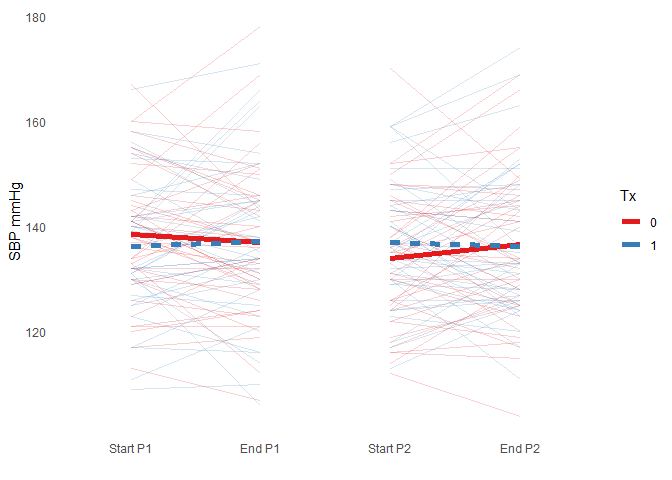
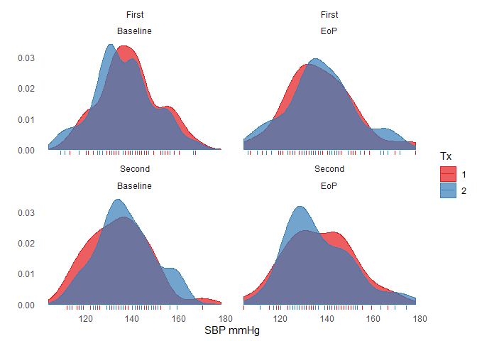

For this tutorial we will be working with a dataset from a standard 2 period, 2 intervention AB:BA cross-over trial of a treatment aimed at lowering blood pressure in people who usually have mildly-evaluated values. In other words, each person in the trial gets exposured to each intervention (active vs placebo), but in one of two possible sequences (active first vs placebo first). 

We can load the dataset from the *.RData object in the data folder. 


Have a look at the dataset. 


```r
  View(df)
```


```r
  library(summarytools)
  view(dfSummary(df))
```

We can see there are 4 SBP values per patient (row). These are the start and end values for each of the two periods. To visualize and analyze these data correctly, we need to convert the dataset so that it's "long", i.e. one row for each time point


```r
# Reshape the data on 4 SBP values in order to plot the within period changes
# by tx group, get missing values. See functions.R

  df_long <- gather(df, time, value, starts_with("sbp")) %>%
    select(sequence, treatment_p1, treatment_p2, time, value, subj_id, sex, 
           everything()) %>%
    mutate(sequence = factor(sequence), treatment_p1 = factor(treatment_p1),
           treatment_p2 = factor(treatment_p2))

  view(dfSummary(df_long))
```

Now you can see there are five timepoints (screening, plus the start and end values for each of the two periods), each with 83 observations, which is the number of study participants. 

Now let's clean up the data a bit. 


```r
  df_long$time <- gsub("sbp__|sbp", "", df_long$time) # remove extraneous info

# Just reordering the levels so they mactch time. This will help when we plot
# the data. 
  times <- c("b_p1", "ep_p1", "b_p2", "ep_p2")

  df_long <- mutate(df_long, time = factor(time, levels = times)) 
# table(df_long$time)

# Create a new variable to reflect the period  
  df_long$period[grepl("_p1", df_long$time)] <- "First"
  df_long$period[grepl("_p2", df_long$time)] <- "Second"

# Create a new variable to reflect start (baseline) or end of period  
  bp <- grepl("b_p",  df_long$time) # Baseline times
  ep <- grepl("ep_p", df_long$time) # End times

  df_long$timing[bp] <- "Baseline"
  df_long$timing[ep] <- "EoP"
  
# with(df_long, table(period, timing))  

  df_long$bl[bp] <- df_long$value[bp] # Baseline SBPs
  df_long$ep[ep] <- df_long$value[ep] # End SBPs

# Treatment indicator  
  p1 <- df_long$period == "First"  & !is.na(df_long$period)
  p2 <- df_long$period == "Second" & !is.na(df_long$period)
  df_long$tx[p1] <- df_long$treatment_p1[p1]
  df_long$tx[p2] <- df_long$treatment_p2[p2]

  df_long <- filter(df_long, !is.na(time)) %>%
    arrange(subj_id, period, timing) %>%
    select(subj_id, sequence, period, timing, tx, value, everything()) %>%
    mutate(period = factor(period),
           timing = factor(timing),
           tx  = factor(tx))

  df_long$time2 <- factor(df_long$time, labels = c("p1_b", "p1_ep",
                                         "p2_b", "p2_ep"))

# View(df_long)
  
  view(dfSummary(df_long))
```


```r
  ggplot(df_long, aes(x = time2, y = value, group = subj_id)) +
    geom_line(data = filter(df_long, as.numeric(time) < 3), alpha = 0.2,
              aes(color = treatment_p1)) +
    geom_smooth(data = filter(df_long, as.numeric(time) < 3), method = "lm",
                aes(color = treatment_p1, linetype = treatment_p1,
                group = treatment_p1),
                se = FALSE, size = 2) +
    geom_line(data = filter(df_long, as.numeric(time) > 2), alpha = 0.2,
              aes(color = treatment_p2)) +
    geom_smooth(data = filter(df_long, as.numeric(time) > 2), method = "lm",
                aes(color = treatment_p2, linetype = treatment_p2,
                    group = treatment_p2),
                se = FALSE, size = 2) +
    scale_linetype(guide = FALSE) +
    theme_minimal() +
    scale_color_brewer("Tx", palette = "Set1") +
    theme(panel.grid.major = element_blank(),
        panel.grid.minor = element_blank()) +
    scale_x_discrete(labels = c("Start P1", "End P1", "Start P2", "End P2")) +
    xlab("") +
    ylab("SBP mmHg")
```

<!-- -->


```r
# Distribution plot

  ggplot(df_long, aes(x = value, fill = tx, color = tx)) +
    geom_density(alpha = 0.7) +
    geom_rug() +
    scale_fill_brewer("Tx", palette = "Set1") +
    scale_color_brewer("Tx", palette = "Set1") +
    facet_wrap(~period + timing) +
    theme_minimal() +
    theme(panel.grid.major = element_blank(),
          panel.grid.minor = element_blank()) +
    ylab("") +
    xlab("SBP mmHg")
```

<!-- -->


```r
# Models

  me_sbp_df <- full_join(
    select(df_long, subj_id, sex, period, bl, tx) %>% filter(!is.na(bl)),
    select(df_long, subj_id, sex, period, ep, tx) %>% filter(!is.na(ep)),
    by = c("subj_id", "period", "tx", "sex")
  ) %>%
    mutate(bl = scale(bl, scale = FALSE))


  me_sbp     <- lmer(ep ~ tx + sex +               (1 | subj_id),
                     data = me_sbp_df)
  me_sbp_p   <- lmer(ep ~ tx + sex + period +      (1 | subj_id),
                     data = me_sbp_df)
  me_sbp_int <- lmer(ep ~ tx * period +  sex +     (1 | subj_id),
                     data = me_sbp_df)
  me_sbp_bl  <- lmer(ep ~ tx + sex + period + bl + (1 | subj_id),
                     data = me_sbp_df)


  labs <- c("Intercept", "Treatment", "Sex", "Period")

  tab_model(
    me_sbp, me_sbp_p, me_sbp_bl,
    p.val = "kr",
    file = "tables/primary/table_me_sbp.html",
    pred.labels = c(labs, "SBP Baseline"),
    dv.labels = c("Unadjusted", "+ Period effect", "+ Baselines")
    )
```

<table style="border-collapse:collapse; border:none;">
<tr>
<th style="border-top: double; text-align:center; font-style:normal; font-weight:bold; padding:0.2cm;  text-align:left; ">&nbsp;</th>
<th colspan="3" style="border-top: double; text-align:center; font-style:normal; font-weight:bold; padding:0.2cm; ">Unadjusted</th>
<th colspan="3" style="border-top: double; text-align:center; font-style:normal; font-weight:bold; padding:0.2cm; ">+ Period effect</th>
<th colspan="3" style="border-top: double; text-align:center; font-style:normal; font-weight:bold; padding:0.2cm; ">+ Baselines</th>
</tr>
<tr>
<td style=" text-align:center; border-bottom:1px solid; font-style:italic; font-weight:normal;  text-align:left; ">Predictors</td>
<td style=" text-align:center; border-bottom:1px solid; font-style:italic; font-weight:normal;  ">Estimates</td>
<td style=" text-align:center; border-bottom:1px solid; font-style:italic; font-weight:normal;  ">CI</td>
<td style=" text-align:center; border-bottom:1px solid; font-style:italic; font-weight:normal;  ">p</td>
<td style=" text-align:center; border-bottom:1px solid; font-style:italic; font-weight:normal;  ">Estimates</td>
<td style=" text-align:center; border-bottom:1px solid; font-style:italic; font-weight:normal;  ">CI</td>
<td style=" text-align:center; border-bottom:1px solid; font-style:italic; font-weight:normal;  col7">p</td>
<td style=" text-align:center; border-bottom:1px solid; font-style:italic; font-weight:normal;  col8">Estimates</td>
<td style=" text-align:center; border-bottom:1px solid; font-style:italic; font-weight:normal;  col9">CI</td>
<td style=" text-align:center; border-bottom:1px solid; font-style:italic; font-weight:normal;  0">p</td>
</tr>
<tr>
<td style=" padding:0.2cm; text-align:left; vertical-align:top; text-align:left; ">Intercept</td>
<td style=" padding:0.2cm; text-align:left; vertical-align:top; text-align:center;  ">137.79</td>
<td style=" padding:0.2cm; text-align:left; vertical-align:top; text-align:center;  ">133.78&nbsp;&ndash;&nbsp;141.80</td>
<td style=" padding:0.2cm; text-align:left; vertical-align:top; text-align:center;  "><strong>&lt;0.001</td>
<td style=" padding:0.2cm; text-align:left; vertical-align:top; text-align:center;  ">138.21</td>
<td style=" padding:0.2cm; text-align:left; vertical-align:top; text-align:center;  ">134.03&nbsp;&ndash;&nbsp;142.40</td>
<td style=" padding:0.2cm; text-align:left; vertical-align:top; text-align:center;  col7"><strong>&lt;0.001</td>
<td style=" padding:0.2cm; text-align:left; vertical-align:top; text-align:center;  col8">136.18</td>
<td style=" padding:0.2cm; text-align:left; vertical-align:top; text-align:center;  col9">132.98&nbsp;&ndash;&nbsp;139.39</td>
<td style=" padding:0.2cm; text-align:left; vertical-align:top; text-align:center;  0"><strong>&lt;0.001</td>
</tr>
<tr>
<td style=" padding:0.2cm; text-align:left; vertical-align:top; text-align:left; ">Treatment</td>
<td style=" padding:0.2cm; text-align:left; vertical-align:top; text-align:center;  ">0.24</td>
<td style=" padding:0.2cm; text-align:left; vertical-align:top; text-align:center;  ">-2.12&nbsp;&ndash;&nbsp;2.61</td>
<td style=" padding:0.2cm; text-align:left; vertical-align:top; text-align:center;  ">0.840</td>
<td style=" padding:0.2cm; text-align:left; vertical-align:top; text-align:center;  ">0.25</td>
<td style=" padding:0.2cm; text-align:left; vertical-align:top; text-align:center;  ">-2.12&nbsp;&ndash;&nbsp;2.63</td>
<td style=" padding:0.2cm; text-align:left; vertical-align:top; text-align:center;  col7">0.834</td>
<td style=" padding:0.2cm; text-align:left; vertical-align:top; text-align:center;  col8">-0.08</td>
<td style=" padding:0.2cm; text-align:left; vertical-align:top; text-align:center;  col9">-2.92&nbsp;&ndash;&nbsp;2.77</td>
<td style=" padding:0.2cm; text-align:left; vertical-align:top; text-align:center;  0">0.957</td>
</tr>
<tr>
<td style=" padding:0.2cm; text-align:left; vertical-align:top; text-align:left; ">Sex</td>
<td style=" padding:0.2cm; text-align:left; vertical-align:top; text-align:center;  ">-2.94</td>
<td style=" padding:0.2cm; text-align:left; vertical-align:top; text-align:center;  ">-8.67&nbsp;&ndash;&nbsp;2.79</td>
<td style=" padding:0.2cm; text-align:left; vertical-align:top; text-align:center;  ">0.317</td>
<td style=" padding:0.2cm; text-align:left; vertical-align:top; text-align:center;  ">-2.96</td>
<td style=" padding:0.2cm; text-align:left; vertical-align:top; text-align:center;  ">-8.69&nbsp;&ndash;&nbsp;2.77</td>
<td style=" padding:0.2cm; text-align:left; vertical-align:top; text-align:center;  col7">0.315</td>
<td style=" padding:0.2cm; text-align:left; vertical-align:top; text-align:center;  col8">0.80</td>
<td style=" padding:0.2cm; text-align:left; vertical-align:top; text-align:center;  col9">-2.94&nbsp;&ndash;&nbsp;4.53</td>
<td style=" padding:0.2cm; text-align:left; vertical-align:top; text-align:center;  0">0.677</td>
</tr>
<tr>
<td style=" padding:0.2cm; text-align:left; vertical-align:top; text-align:left; ">Period</td>
<td style=" padding:0.2cm; text-align:left; vertical-align:top; text-align:center;  "></td>
<td style=" padding:0.2cm; text-align:left; vertical-align:top; text-align:center;  "></td>
<td style=" padding:0.2cm; text-align:left; vertical-align:top; text-align:center;  "></td>
<td style=" padding:0.2cm; text-align:left; vertical-align:top; text-align:center;  ">-0.84</td>
<td style=" padding:0.2cm; text-align:left; vertical-align:top; text-align:center;  ">-3.21&nbsp;&ndash;&nbsp;1.54</td>
<td style=" padding:0.2cm; text-align:left; vertical-align:top; text-align:center;  col7">0.491</td>
<td style=" padding:0.2cm; text-align:left; vertical-align:top; text-align:center;  col8">0.51</td>
<td style=" padding:0.2cm; text-align:left; vertical-align:top; text-align:center;  col9">-2.35&nbsp;&ndash;&nbsp;3.37</td>
<td style=" padding:0.2cm; text-align:left; vertical-align:top; text-align:center;  0">0.726</td>
</tr>
<tr>
<td style=" padding:0.2cm; text-align:left; vertical-align:top; text-align:left; ">SBP Baseline</td>
<td style=" padding:0.2cm; text-align:left; vertical-align:top; text-align:center;  "></td>
<td style=" padding:0.2cm; text-align:left; vertical-align:top; text-align:center;  "></td>
<td style=" padding:0.2cm; text-align:left; vertical-align:top; text-align:center;  "></td>
<td style=" padding:0.2cm; text-align:left; vertical-align:top; text-align:center;  "></td>
<td style=" padding:0.2cm; text-align:left; vertical-align:top; text-align:center;  "></td>
<td style=" padding:0.2cm; text-align:left; vertical-align:top; text-align:center;  col7"></td>
<td style=" padding:0.2cm; text-align:left; vertical-align:top; text-align:center;  col8">0.71</td>
<td style=" padding:0.2cm; text-align:left; vertical-align:top; text-align:center;  col9">0.57&nbsp;&ndash;&nbsp;0.85</td>
<td style=" padding:0.2cm; text-align:left; vertical-align:top; text-align:center;  0"><strong>&lt;0.001</td>
</tr>
<tr>
<td colspan="10" style="font-weight:bold; text-align:left; padding-top:.8em;">Random Effects</td>
</tr>

<tr>
<td style=" padding:0.2cm; text-align:left; vertical-align:top; text-align:left; padding-top:0.1cm; padding-bottom:0.1cm;">&sigma;<sup>2</sup></td>
<td style=" padding:0.2cm; text-align:left; vertical-align:top; padding-top:0.1cm; padding-bottom:0.1cm; text-align:left;" colspan="3">59.31</td>
<td style=" padding:0.2cm; text-align:left; vertical-align:top; padding-top:0.1cm; padding-bottom:0.1cm; text-align:left;" colspan="3">59.68</td>
<td style=" padding:0.2cm; text-align:left; vertical-align:top; padding-top:0.1cm; padding-bottom:0.1cm; text-align:left;" colspan="3">85.50</td>

<tr>
<td style=" padding:0.2cm; text-align:left; vertical-align:top; text-align:left; padding-top:0.1cm; padding-bottom:0.1cm;">&tau;<sub>00</sub></td>
<td style=" padding:0.2cm; text-align:left; vertical-align:top; padding-top:0.1cm; padding-bottom:0.1cm; text-align:left;" colspan="3">144.89 <sub>subj_id</sub></td>
<td style=" padding:0.2cm; text-align:left; vertical-align:top; padding-top:0.1cm; padding-bottom:0.1cm; text-align:left;" colspan="3">144.76 <sub>subj_id</sub></td>
<td style=" padding:0.2cm; text-align:left; vertical-align:top; padding-top:0.1cm; padding-bottom:0.1cm; text-align:left;" colspan="3">27.63 <sub>subj_id</sub></td>

<tr>
<td style=" padding:0.2cm; text-align:left; vertical-align:top; text-align:left; padding-top:0.1cm; padding-bottom:0.1cm;">ICC</td>
<td style=" padding:0.2cm; text-align:left; vertical-align:top; padding-top:0.1cm; padding-bottom:0.1cm; text-align:left;" colspan="3">0.71</td>
<td style=" padding:0.2cm; text-align:left; vertical-align:top; padding-top:0.1cm; padding-bottom:0.1cm; text-align:left;" colspan="3">0.71</td>
<td style=" padding:0.2cm; text-align:left; vertical-align:top; padding-top:0.1cm; padding-bottom:0.1cm; text-align:left;" colspan="3">0.24</td>

<tr>
<td style=" padding:0.2cm; text-align:left; vertical-align:top; text-align:left; padding-top:0.1cm; padding-bottom:0.1cm;">N</td>
<td style=" padding:0.2cm; text-align:left; vertical-align:top; padding-top:0.1cm; padding-bottom:0.1cm; text-align:left;" colspan="3">83 <sub>subj_id</sub></td>
<td style=" padding:0.2cm; text-align:left; vertical-align:top; padding-top:0.1cm; padding-bottom:0.1cm; text-align:left;" colspan="3">83 <sub>subj_id</sub></td>
<td style=" padding:0.2cm; text-align:left; vertical-align:top; padding-top:0.1cm; padding-bottom:0.1cm; text-align:left;" colspan="3">83 <sub>subj_id</sub></td>
<tr>
<td style=" padding:0.2cm; text-align:left; vertical-align:top; text-align:left; padding-top:0.1cm; padding-bottom:0.1cm; border-top:1px solid;">Observations</td>
<td style=" padding:0.2cm; text-align:left; vertical-align:top; padding-top:0.1cm; padding-bottom:0.1cm; text-align:left; border-top:1px solid;" colspan="3">164</td>
<td style=" padding:0.2cm; text-align:left; vertical-align:top; padding-top:0.1cm; padding-bottom:0.1cm; text-align:left; border-top:1px solid;" colspan="3">164</td>
<td style=" padding:0.2cm; text-align:left; vertical-align:top; padding-top:0.1cm; padding-bottom:0.1cm; text-align:left; border-top:1px solid;" colspan="3">163</td>
</tr>
<tr>
<td style=" padding:0.2cm; text-align:left; vertical-align:top; text-align:left; padding-top:0.1cm; padding-bottom:0.1cm;">Marginal R<sup>2</sup> / Conditional R<sup>2</sup></td>
<td style=" padding:0.2cm; text-align:left; vertical-align:top; padding-top:0.1cm; padding-bottom:0.1cm; text-align:left;" colspan="3">0.010 / 0.713</td>
<td style=" padding:0.2cm; text-align:left; vertical-align:top; padding-top:0.1cm; padding-bottom:0.1cm; text-align:left;" colspan="3">0.011 / 0.711</td>
<td style=" padding:0.2cm; text-align:left; vertical-align:top; padding-top:0.1cm; padding-bottom:0.1cm; text-align:left;" colspan="3">0.404 / 0.549</td>
</tr>

</table>

